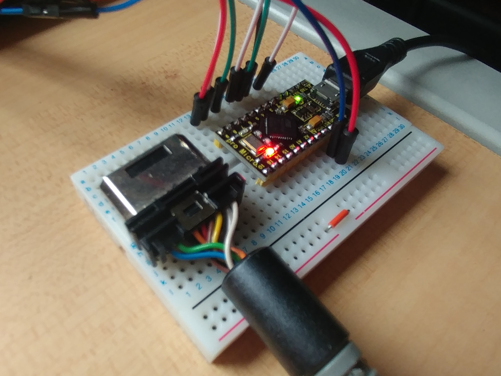

# arduino-saturn-joystick

Convert Sega Saturn controller to USB HID joypad using Arduino Leonardo / Pro Micro. 

## Require library

Install from Arduino library manager.

* [TimerOne](https://www.pjrc.com/teensy/td_libs_TimerOne.html)
* [Arduino Joystick Library](https://github.com/MHeironimus/ArduinoJoystickLibrary)

## Connection

```
Saturn             Arduiono Pro Micro
1 - VCC - blue     5V
2 - D1  - green    D3
3 - D0  - black    D2
4 - S0  - orange   D8
5 - S1  - red      D9
6 - VCC - brown    5V
7 - D3  - yellow   D6
8 - D2  - gray     D4
9 - GND - white    GND
```



Enjoy!